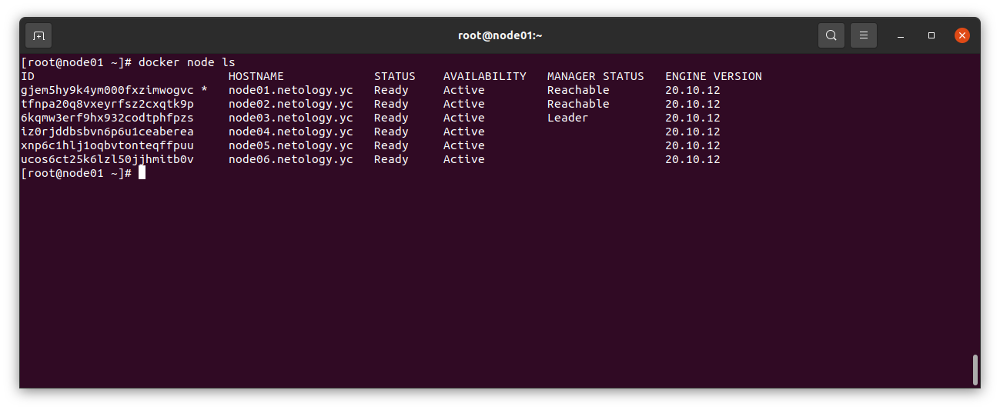
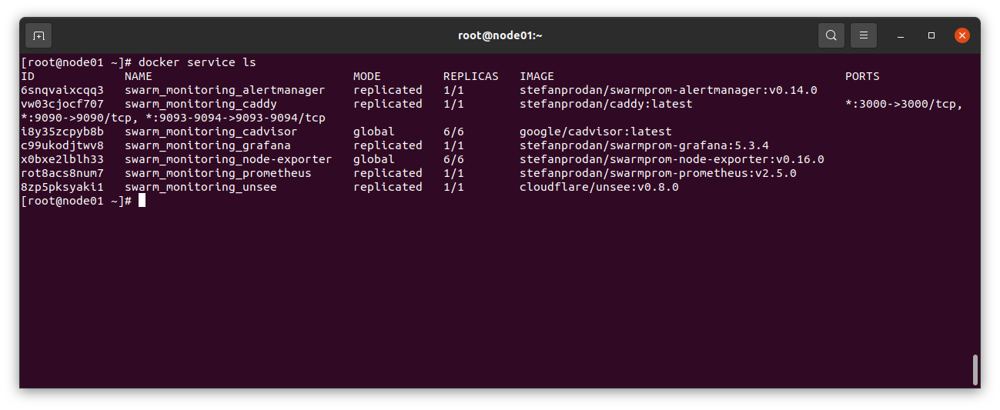

# Домашнее задание к занятию "5.5. Оркестрация кластером Docker контейнеров на примере Docker Swarm"

## Задача 1

Дайте письменые ответы на следующие вопросы:

- В чём отличие режимов работы сервисов в Docker Swarm кластере: replication и global?

В режиме global контейнеры запускаются на всех нодах кластера, а в режиме replication - только на том количестве нод, которое указано в опции --replicas.

- Какой алгоритм выбора лидера используется в Docker Swarm кластере?

В кластере Docker Swarm для выбора лидера используется алгоритм Raft. Данный алгоритм основан на таймаутах перевыборов (случайные величины от 150 до 300 мс), по истечении которого
хост из фоловера переходит в режим кандидата и рассылает остальным хостам запрос на выбор лидера и, получив большинство ответов о выборе, становится лидером и рассылает об этом уведомление всем хостам. 
Далее через определенные промежутки времени лидер рассылает всем хостам сообщения heartbeat, которые сбрасывают таймаут перевыбора на хостах. Так же через эти сообщения осуществляется
синхронизация состояния кластера. Если лидер падает, то хосты не получают сообщения heartbeat и в какой-то момент у одного из них завершается таймаут перевыборов и этот хост
становится кандидатом и все происходит сначала.

- Что такое Overlay Network?

Overlay Network - это виртуальная сеть, которая поднимается поверх физических сетей и связывает контейнеры внутри кластера Docker Swarm. Overlay сеть инкапсулирует L2 трафик
в пакеты L4 и работает через UDP порт 4789.

## Задача 2

Создать ваш первый Docker Swarm кластер в Яндекс.Облаке

Для получения зачета, вам необходимо предоставить скриншот из терминала (консоли), с выводом команды:
```
docker node ls
```



## Задача 3

Создать ваш первый, готовый к боевой эксплуатации кластер мониторинга, состоящий из стека микросервисов.

Для получения зачета, вам необходимо предоставить скриншот из терминала (консоли), с выводом команды:
```
docker service ls
```



## Задача 4 (*)

Выполнить на лидере Docker Swarm кластера команду (указанную ниже) и дать письменное описание её функционала, что она делает и зачем она нужна:
```
# см.документацию: https://docs.docker.com/engine/swarm/swarm_manager_locking/
docker swarm update --autolock=true
```

Данная команда включает функцию автоблокировки, она используется для защиты ключей шифрования связи между узлами и шифрования журналов Raft.
После перезапуска службы Docker, чтобы получить доступ к кластеру, его необходимо разблокировать с помощью ключа разблокировки. Данная функция была введена по причине 
введения функции секретов в Docker (на подобии распечатывания в Hashicorp Vault).
