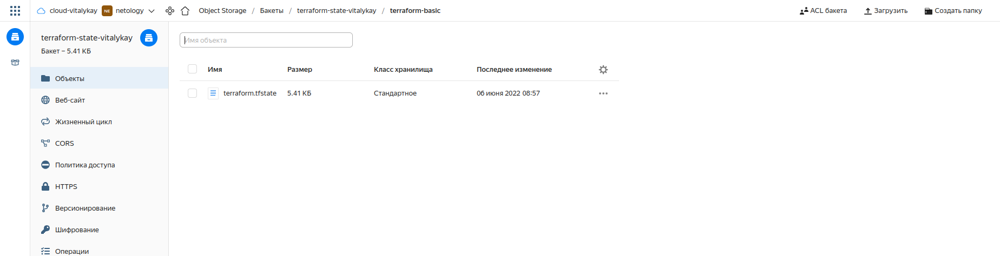
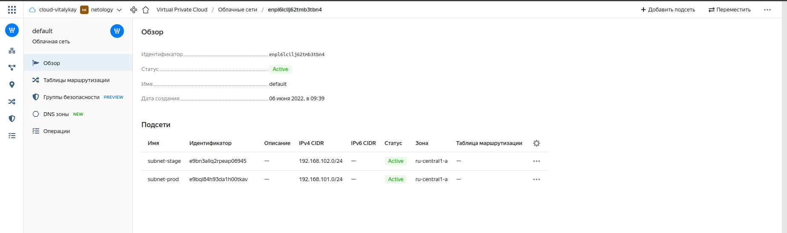
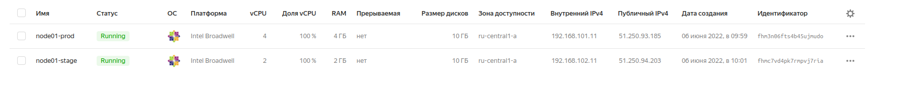

# Домашнее задание к занятию "7.3. Основы и принцип работы Терраформ"

## Задача 1. Создадим бэкэнд в S3 (необязательно, но крайне желательно).

Если в рамках предыдущего задания у вас уже есть аккаунт AWS, то давайте продолжим знакомство со взаимодействием
терраформа и aws. 

1. Создайте s3 бакет, iam роль и пользователя от которого будет работать терраформ. Можно создать отдельного пользователя,
а можно использовать созданного в рамках предыдущего задания, просто добавьте ему необходимы права, как описано 
[здесь](https://www.terraform.io/docs/backends/types/s3.html).

```terraform
resource "yandex_iam_service_account_static_access_key" "sa-static-key" {
  service_account_id = "#####################"
  description = "static access key for object storage"
}

resource "yandex_storage_bucket" "terraform_state" {
  access_key = yandex_iam_service_account_static_access_key.sa-static-key.access_key
  secret_key = yandex_iam_service_account_static_access_key.sa-static-key.secret_key
  bucket = "terraform-state-vitalykay"
}
```

2. Зарегистрируйте бэкэнд в терраформ проекте как описано по ссылке выше. 

```terraform
backend "s3" {
    endpoint   = "storage.yandexcloud.net"
    bucket = "terraform-state-vitalykay"
    key    = "terraform-basic/terraform.tfstate"
    region = "ru-central1"
    access_key = "#######################"
    secret_key = "###################################"

    skip_region_validation      = true
    skip_credentials_validation = true
  }
```


## Задача 2. Инициализируем проект и создаем воркспейсы. 

1. Выполните `terraform init`:
    * если был создан бэкэнд в S3, то терраформ создат файл стейтов в S3 и запись в таблице 
dynamodb.
    * иначе будет создан локальный файл со стейтами.  
   
>
> 
> 

2. Создайте два воркспейса `stage` и `prod`.
```commandline
vitalykay@sams:~/devops-netology/7.3.terraform-basic/src$ terraform workspace show
default
vitalykay@sams:~/devops-netology/7.3.terraform-basic/src$ terraform workspace new stage
Created and switched to workspace "stage"!

You're now on a new, empty workspace. Workspaces isolate their state,
so if you run "terraform plan" Terraform will not see any existing state
for this configuration.
vitalykay@sams:~/devops-netology/7.3.terraform-basic/src$ terraform workspace new prod
Created and switched to workspace "prod"!

You're now on a new, empty workspace. Workspaces isolate their state,
so if you run "terraform plan" Terraform will not see any existing state
for this configuration.
vitalykay@sams:~/devops-netology/7.3.terraform-basic/src$ terraform workspace list
  default
* prod
  stage
```

3. В уже созданный `aws_instance` добавьте зависимость типа инстанса от вокспейса, что бы в разных ворскспейсах 
использовались разные `instance_type`.

>
> Из-за ограничений аккаунта в Яндекс.Облаке пришлось создавать разные подсети в одной сети
> 
> 
> 
> 
> 
> ```terraform
> resource "yandex_vpc_subnet" "default" {
>   name = terraform.workspace == "prod" ? "subnet-prod" : "subnet-stage"
>   zone           = "ru-central1-a"
>   network_id     = "enpl6lcilj62tmb3tbn4" #"${yandex_vpc_network.default.id}"
> v4_cidr_blocks = terraform.workspace == "prod" ? ["192.168.101.0/24"] : ["192.168.102.0/24"]
> }
> 
> resource "yandex_compute_instance" "node01" {
>   name                      = terraform.workspace == "prod" ? "node01-prod" : "node01-stage"
> zone                      = "ru-central1-a"
>   hostname                  = terraform.workspace == "prod" ? "node01-prod.netology.yc" : "node01-stage.netology.yc"
>   allow_stopping_for_update = true
> 
>   resources {
>     cores  = terraform.workspace == "prod" ? 4 : 2
>     memory = terraform.workspace == "prod" ? 4 : 2
>   }
> 
>   boot_disk {
>     initialize_params {
>       image_id    = "fd8hqa9gq1d59afqonsf"
>       type        = "network-nvme"
>       size        = "10"
>     }
>   }
> 
>   network_interface {
>     subnet_id  = "${yandex_vpc_subnet.default.id}"
>     nat        = true
>     ip_address = terraform.workspace == "prod" ? "192.168.101.11" : "192.168.102.11"
>   }
> 
>   metadata = {
>     ssh-keys = "centos:${file("~/.ssh/id_ed25519.pub")}"
>   }
> }
> ```
> 

4. Добавим `count`. Для `stage` должен создаться один экземпляр `ec2`, а для `prod` два. 

>
> ```terraform
> resource "yandex_compute_instance" "node" {
>   name                      = terraform.workspace == "prod" ? "node${count.index}-prod" : "node${count.index}-stage"
>   zone                      = "ru-central1-a"
>   hostname                  = terraform.workspace == "prod" ? "node${count.index}-prod.netology.yc" : "node${count.index}-stage.netology.yc"
>   allow_stopping_for_update = true
>   count = terraform.workspace == "prod" ? 2 : 1
> 
>   resources {
>     cores  = terraform.workspace == "prod" ? 4 : 2
>     memory = terraform.workspace == "prod" ? 4 : 2
>   }
> 
>   boot_disk {
>     initialize_params {
>       image_id    = "fd8hqa9gq1d59afqonsf"
>       type        = "network-nvme"
>       size        = "10"
>     }
>   }
> 
>   network_interface {
>     subnet_id  = "${yandex_vpc_subnet.default.id}"
>     nat        = true
>   }
> 
>   metadata = {
>     ssh-keys = "centos:${file("~/.ssh/id_ed25519.pub")}"
>   }
> }
> ```
> 

5. Создайте рядом еще один `aws_instance`, но теперь определите их количество при помощи `for_each`, а не `count`.

>
> ```terraform
> resource "yandex_compute_instance" "node-foreach" {
>   for_each = toset(terraform.workspace == "prod" ? ["node01","node02"] : ["node01"])
>   name                      = "${each.value}-${terraform.workspace == "prod" ? "prod" : "stage"}"
>   zone                      = "ru-central1-a"
>   hostname                  = "${each.value}-${terraform.workspace == "prod" ? "prod" : "-stage"}.netology.yc"
>   allow_stopping_for_update = true
> 
>   resources {
>     cores  = 2
>     memory = 2
>   }
> 
>   boot_disk {
>     initialize_params {
>       image_id    = "fd8hqa9gq1d59afqonsf"
>       type        = "network-nvme"
>       size        = "10"
>     }
>   }
> 
>   network_interface {
>     subnet_id  = "${yandex_vpc_subnet.default.id}"
>     nat        = true
>   }
> 
>   metadata = {
>     ssh-keys = "centos:${file("~/.ssh/id_ed25519.pub")}"
>   }
> }
> ```
> 

6. Что бы при изменении типа инстанса не возникло ситуации, когда не будет ни одного инстанса добавьте параметр
жизненного цикла `create_before_destroy = true` в один из рессурсов `aws_instance`.

```commandline
vitalykay@sams:~/devops-netology/7.3.terraform-basic/src$ terraform apply
yandex_vpc_network.default: Refreshing state... [id=enpdlm400tofsmfqqtp1]
yandex_vpc_subnet.default: Refreshing state... [id=e9b6vil7cjvrphkh28jt]
yandex_compute_instance.node-foreach["node01"]: Refreshing state... [id=fhmvsm7h1n2t4asnolec]
yandex_compute_instance.node-foreach["node02"]: Refreshing state... [id=fhmqmh72ihpi52pmlbn8]

Note: Objects have changed outside of Terraform

Terraform detected the following changes made outside of Terraform since the last "terraform apply":

  # yandex_compute_instance.node-foreach["node01"] has changed
  ~ resource "yandex_compute_instance" "node-foreach" {
        id                        = "fhmvsm7h1n2t4asnolec"
      + labels                    = {}
        # (10 unchanged attributes hidden)


        # (5 unchanged blocks hidden)
    }

  # yandex_compute_instance.node-foreach["node02"] has changed
  ~ resource "yandex_compute_instance" "node-foreach" {
        id                        = "fhmqmh72ihpi52pmlbn8"
      + labels                    = {}
        # (10 unchanged attributes hidden)


        # (5 unchanged blocks hidden)
    }

  # yandex_vpc_network.default has changed
  ~ resource "yandex_vpc_network" "default" {
        id         = "enpdlm400tofsmfqqtp1"
      ~ subnet_ids = [
          + "e9b6vil7cjvrphkh28jt",
        ]
        # (3 unchanged attributes hidden)
    }


Unless you have made equivalent changes to your configuration, or ignored the relevant attributes using ignore_changes, the following plan may include actions
to undo or respond to these changes.

────────────────────────────────────────────────────────────────────────────────────────────────────────────────────────────────────────────────────────────────

Terraform used the selected providers to generate the following execution plan. Resource actions are indicated with the following symbols:
+/- create replacement and then destroy

Terraform will perform the following actions:

  # yandex_compute_instance.node-foreach["node01"] must be replaced
+/- resource "yandex_compute_instance" "node-foreach" {
      ~ created_at                = "2022-06-06T13:27:30Z" -> (known after apply)
      ~ folder_id                 = "b1gf6kkr9lt4lofiqh08" -> (known after apply)
      ~ fqdn                      = "fhmvsm7h1n2t4asnolec.auto.internal" -> (known after apply)
      ~ hostname                  = "fhmvsm7h1n2t4asnolec" -> (known after apply)
      ~ id                        = "fhmvsm7h1n2t4asnolec" -> (known after apply)
      - labels                    = {} -> null
      + service_account_id        = (known after apply)
      ~ status                    = "running" -> (known after apply)
        # (5 unchanged attributes hidden)

      ~ boot_disk {
          ~ device_name = "fhmqclufhncu5n40u7j3" -> (known after apply)
          ~ disk_id     = "fhmqclufhncu5n40u7j3" -> (known after apply)
          ~ mode        = "READ_WRITE" -> (known after apply)
            # (1 unchanged attribute hidden)

          ~ initialize_params {
              ~ block_size  = 4096 -> (known after apply)
              + description = (known after apply)
              + name        = (known after apply)
              + snapshot_id = (known after apply)
              ~ type        = "network-ssd" -> "network-nvme" # forces replacement
                # (2 unchanged attributes hidden)
            }
        }

      ~ network_interface {
          ~ index              = 0 -> (known after apply)
          ~ ip_address         = "192.168.101.8" -> (known after apply)
          ~ ipv6               = false -> (known after apply)
          + ipv6_address       = (known after apply)
          ~ mac_address        = "d0:0d:1f:e5:8f:10" -> (known after apply)
          ~ nat_ip_address     = "51.250.95.142" -> (known after apply)
          ~ nat_ip_version     = "IPV4" -> (known after apply)
          ~ security_group_ids = [] -> (known after apply)
            # (3 unchanged attributes hidden)
        }

      ~ placement_policy {
          ~ host_affinity_rules = [] -> (known after apply)
          + placement_group_id  = (known after apply)
        }

      ~ resources {
          ~ cores         = 4 -> 2
          - gpus          = 0 -> null
          ~ memory        = 4 -> 2
            # (1 unchanged attribute hidden)
        }

      ~ scheduling_policy {
          ~ preemptible = false -> (known after apply)
        }
    }

  # yandex_compute_instance.node-foreach["node02"] must be replaced
+/- resource "yandex_compute_instance" "node-foreach" {
      ~ created_at                = "2022-06-06T13:27:30Z" -> (known after apply)
      ~ folder_id                 = "b1gf6kkr9lt4lofiqh08" -> (known after apply)
      ~ fqdn                      = "fhmqmh72ihpi52pmlbn8.auto.internal" -> (known after apply)
      ~ hostname                  = "fhmqmh72ihpi52pmlbn8" -> (known after apply)
      ~ id                        = "fhmqmh72ihpi52pmlbn8" -> (known after apply)
      - labels                    = {} -> null
      + service_account_id        = (known after apply)
      ~ status                    = "running" -> (known after apply)
        # (5 unchanged attributes hidden)

      ~ boot_disk {
          ~ device_name = "fhm76csesvcucas27b3l" -> (known after apply)
          ~ disk_id     = "fhm76csesvcucas27b3l" -> (known after apply)
          ~ mode        = "READ_WRITE" -> (known after apply)
            # (1 unchanged attribute hidden)

          ~ initialize_params {
              ~ block_size  = 4096 -> (known after apply)
              + description = (known after apply)
              + name        = (known after apply)
              + snapshot_id = (known after apply)
              ~ type        = "network-ssd" -> "network-nvme" # forces replacement
                # (2 unchanged attributes hidden)
            }
        }

      ~ network_interface {
          ~ index              = 0 -> (known after apply)
          ~ ip_address         = "192.168.101.17" -> (known after apply)
          ~ ipv6               = false -> (known after apply)
          + ipv6_address       = (known after apply)
          ~ mac_address        = "d0:0d:1a:b4:4e:29" -> (known after apply)
          ~ nat_ip_address     = "51.250.12.34" -> (known after apply)
          ~ nat_ip_version     = "IPV4" -> (known after apply)
          ~ security_group_ids = [] -> (known after apply)
            # (3 unchanged attributes hidden)
        }

      ~ placement_policy {
          ~ host_affinity_rules = [] -> (known after apply)
          + placement_group_id  = (known after apply)
        }

      ~ resources {
          ~ cores         = 4 -> 2
          - gpus          = 0 -> null
          ~ memory        = 4 -> 2
            # (1 unchanged attribute hidden)
        }

      ~ scheduling_policy {
          ~ preemptible = false -> (known after apply)
        }
    }

Plan: 2 to add, 0 to change, 2 to destroy.

Changes to Outputs:
  ~ external_ip_address_nodes = [
      - "51.250.95.142",
      - "51.250.12.34",
      + (known after apply),
      + (known after apply),
    ]
  ~ internal_ip_address_nodes = [
      - "192.168.101.8",
      - "192.168.101.17",
      + (known after apply),
      + (known after apply),
    ]

Do you want to perform these actions in workspace "prod"?
  Terraform will perform the actions described above.
  Only 'yes' will be accepted to approve.

  Enter a value: yes

yandex_compute_instance.node-foreach["node02"]: Creating...
yandex_compute_instance.node-foreach["node01"]: Creating...
yandex_compute_instance.node-foreach["node02"]: Still creating... [10s elapsed]
yandex_compute_instance.node-foreach["node01"]: Still creating... [10s elapsed]
yandex_compute_instance.node-foreach["node01"]: Still creating... [20s elapsed]
yandex_compute_instance.node-foreach["node02"]: Still creating... [20s elapsed]
yandex_compute_instance.node-foreach["node01"]: Creation complete after 28s [id=fhmktgtl605h5m1rjr33]
yandex_compute_instance.node-foreach["node02"]: Creation complete after 28s [id=fhmhbism69cgnnajfmib]
yandex_compute_instance.node-foreach["node01"] (deposed object 4f616432): Destroying... [id=fhmvsm7h1n2t4asnolec]
yandex_compute_instance.node-foreach["node02"] (deposed object 15ebc115): Destroying... [id=fhmqmh72ihpi52pmlbn8]
yandex_compute_instance.node-foreach["node01"]: Still destroying... [id=fhmvsm7h1n2t4asnolec, 10s elapsed]
yandex_compute_instance.node-foreach["node02"]: Still destroying... [id=fhmqmh72ihpi52pmlbn8, 10s elapsed]
yandex_compute_instance.node-foreach["node02"]: Destruction complete after 16s
yandex_compute_instance.node-foreach["node01"]: Destruction complete after 16s

Apply complete! Resources: 2 added, 0 changed, 2 destroyed.

Outputs:

external_ip_address_nodes = [
  "51.250.93.75",
  "51.250.87.16",
]
internal_ip_address_nodes = [
  "192.168.101.21",
  "192.168.101.22",
]
```

7. При желании поэкспериментируйте с другими параметрами и рессурсами.

В виде результата работы пришлите:
* Вывод команды `terraform workspace list`.
* Вывод команды `terraform plan` для воркспейса `prod`.  

---

### Как cдавать задание

Выполненное домашнее задание пришлите ссылкой на .md-файл в вашем репозитории.

---