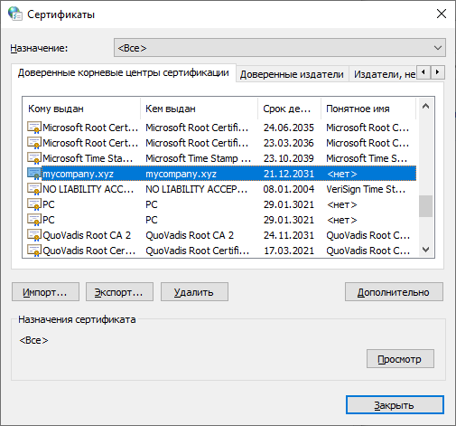
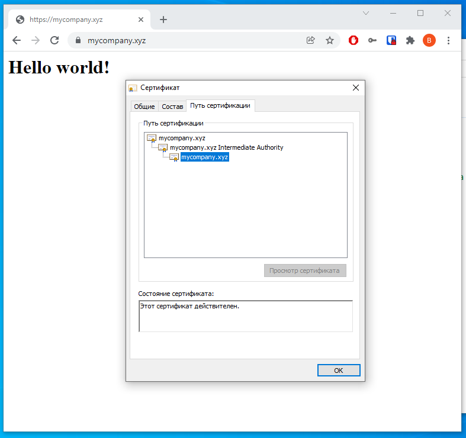
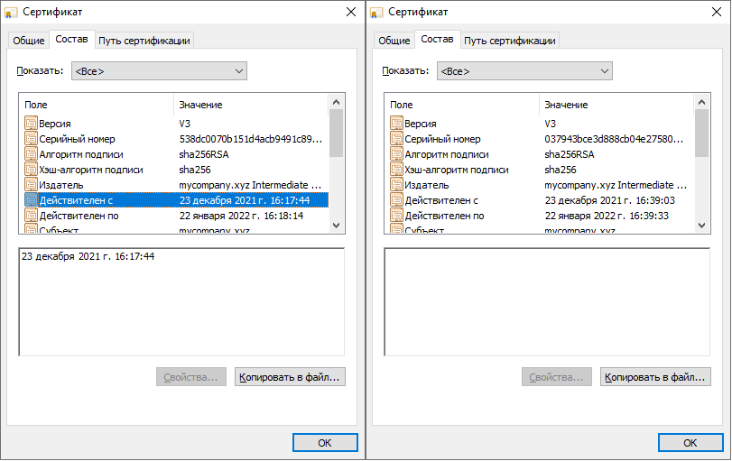
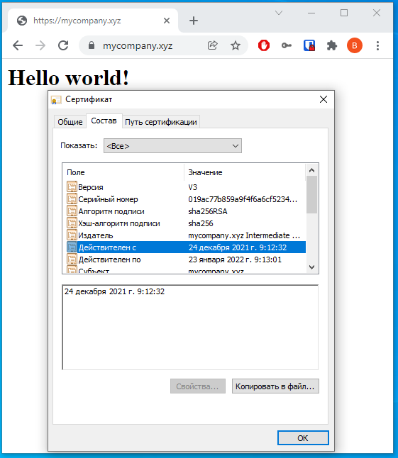
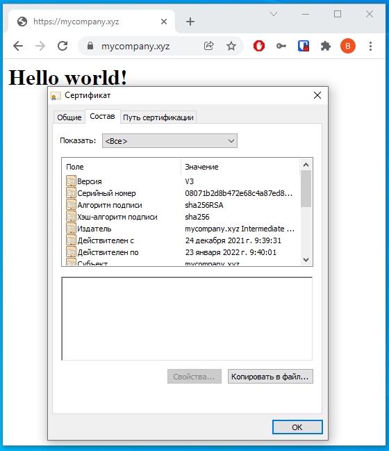

# Курсовая работа по итогам модуля "DevOps и системное администрирование"

## Задание

1. Создайте виртуальную машину Linux.
2. Установите ufw и разрешите к этой машине сессии на порты 22 и 443, при этом трафик на интерфейсе localhost (lo) должен ходить свободно на все порты.
3. Установите hashicorp vault ([инструкция по ссылке](https://learn.hashicorp.com/tutorials/vault/getting-started-install?in=vault/getting-started#install-vault)).
4. Cоздайте центр сертификации по инструкции ([ссылка](https://learn.hashicorp.com/tutorials/vault/pki-engine?in=vault/secrets-management)) и выпустите сертификат для использования его в настройке веб-сервера nginx (срок жизни сертификата - месяц).
5. Установите корневой сертификат созданного центра сертификации в доверенные в хостовой системе.
6. Установите nginx.
7. По инструкции ([ссылка](https://nginx.org/en/docs/http/configuring_https_servers.html)) настройте nginx на https, используя ранее подготовленный сертификат:
  - можно использовать стандартную стартовую страницу nginx для демонстрации работы сервера;
  - можно использовать и другой html файл, сделанный вами;
8. Откройте в браузере на хосте https адрес страницы, которую обслуживает сервер nginx.
9. Создайте скрипт, который будет генерировать новый сертификат в vault:
  - генерируем новый сертификат так, чтобы не переписывать конфиг nginx;
  - перезапускаем nginx для применения нового сертификата.
10. Поместите скрипт в crontab, чтобы сертификат обновлялся какого-то числа каждого месяца в удобное для вас время.

## Результат

Результатом курсовой работы должны быть снимки экрана или текст:

- Процесс установки и настройки ufw
Процесс установки ufw (уже установлен в системе)
```commandline
vagrant@vagrant:~$ sudo apt install ufw
Reading package lists... Done
Building dependency tree       
Reading state information... Done
ufw is already the newest version (0.36-6ubuntu1).
0 upgraded, 0 newly installed, 0 to remove and 0 not upgraded.
```
Настройка ufw
```commandline
root@vagrant:~# ufw status
Status: inactive
root@vagrant:~# ufw default deny incoming
Default incoming policy changed to 'deny'
(be sure to update your rules accordingly)
root@vagrant:~# ufw default allow outgoing
Default outgoing policy changed to 'allow'
(be sure to update your rules accordingly)
root@vagrant:~# ufw allow 22
Rules updated
Rules updated (v6)
root@vagrant:~# ufw allow 443
Rules updated
Rules updated (v6)
root@vagrant:~# ufw allow in on lo
Rules updated
Rules updated (v6)
root@vagrant:~# ufw enable
Command may disrupt existing ssh connections. Proceed with operation (y|n)? y
Firewall is active and enabled on system startup
root@vagrant:~# ufw status verbose
Status: active
Logging: on (low)
Default: deny (incoming), allow (outgoing), disabled (routed)
New profiles: skip

To                         Action      From
--                         ------      ----
22                         ALLOW IN    Anywhere                  
443                        ALLOW IN    Anywhere                  
Anywhere on lo             ALLOW IN    Anywhere                  
22 (v6)                    ALLOW IN    Anywhere (v6)             
443 (v6)                   ALLOW IN    Anywhere (v6)             
Anywhere (v6) on lo        ALLOW IN    Anywhere (v6)             
```
- Процесс установки и выпуска сертификата с помощью hashicorp vault

Установка
```commandline
root@vagrant:~# curl -fsSL https://apt.releases.hashicorp.com/gpg | sudo apt-key add -
OK
root@vagrant:~# apt-add-repository "deb [arch=amd64] https://apt.releases.hashicorp.com $(lsb_release -cs) main"
Get:1 https://apt.releases.hashicorp.com focal InRelease [9,495 B]
Hit:2 http://us.archive.ubuntu.com/ubuntu focal InRelease
Get:3 http://us.archive.ubuntu.com/ubuntu focal-updates InRelease [114 kB]
Get:4 https://apt.releases.hashicorp.com focal/main amd64 Packages [41.1 kB]
Get:5 http://us.archive.ubuntu.com/ubuntu focal-backports InRelease [108 kB]
Get:6 http://us.archive.ubuntu.com/ubuntu focal-security InRelease [114 kB]
Fetched 387 kB in 2s (254 kB/s)   
Reading package lists... Done
root@vagrant:~# apt-get update && apt-get install vault
Hit:1 https://apt.releases.hashicorp.com focal InRelease
Hit:2 http://us.archive.ubuntu.com/ubuntu focal InRelease
Get:3 http://us.archive.ubuntu.com/ubuntu focal-updates InRelease [114 kB]
Get:4 http://us.archive.ubuntu.com/ubuntu focal-backports InRelease [108 kB]
Get:5 http://us.archive.ubuntu.com/ubuntu focal-security InRelease [114 kB]
Fetched 336 kB in 1s (236 kB/s)   
Reading package lists... Done
Reading package lists... Done
Building dependency tree       
Reading state information... Done
The following NEW packages will be installed:
  vault
0 upgraded, 1 newly installed, 0 to remove and 0 not upgraded.
Need to get 69.4 MB of archives.
After this operation, 188 MB of additional disk space will be used.
Get:1 https://apt.releases.hashicorp.com focal/main amd64 vault amd64 1.9.2 [69.4 MB]
Fetched 69.4 MB in 29s (2,403 kB/s)                                            
Selecting previously unselected package vault.
(Reading database ... 40620 files and directories currently installed.)
Preparing to unpack .../archives/vault_1.9.2_amd64.deb ...
Unpacking vault (1.9.2) ...
Setting up vault (1.9.2) ...
Generating Vault TLS key and self-signed certificate...
Generating a RSA private key
.................................................++++
...++++
writing new private key to 'tls.key'
-----
Vault TLS key and self-signed certificate have been generated in '/opt/vault/tls'.
root@vagrant:~# vault
Usage: vault <command> [args]

Common commands:
    read        Read data and retrieves secrets
    write       Write data, configuration, and secrets
    delete      Delete secrets and configuration
    list        List data or secrets
    login       Authenticate locally
    agent       Start a Vault agent
    server      Start a Vault server
    status      Print seal and HA status
    unwrap      Unwrap a wrapped secret

Other commands:
    audit          Interact with audit devices
    auth           Interact with auth methods
    debug          Runs the debug command
    kv             Interact with Vault's Key-Value storage
    lease          Interact with leases
    monitor        Stream log messages from a Vault server
    namespace      Interact with namespaces
    operator       Perform operator-specific tasks
    path-help      Retrieve API help for paths
    plugin         Interact with Vault plugins and catalog
    policy         Interact with policies
    print          Prints runtime configurations
    secrets        Interact with secrets engines
    ssh            Initiate an SSH session
    token          Interact with tokens
```
Выпуск сертификата
```commandline
# Включаем инфраструктуру PKI
root@vagrant:~# vault secrets enable pki
Success! Enabled the pki secrets engine at: pki/
# Настраиваем PKI для выдачи сертификатов с максимальным временем жизни 87600 часов (10 лет)
root@vagrant:~# vault secrets tune -max-lease-ttl=87600h pki
Success! Tuned the secrets engine at: pki/
# Генерируем корневой сертификат и сохраняем в файл CA_cert.crt
root@vagrant:~# vault write -field=certificate pki/root/generate/internal common_name="mycompany.xyz" ttl=87600h > CA_cert.crt
# Настраиваем URL центра сертификации и отозванных сертификатов
root@vagrant:~# vault write pki/config/urls issuing_certificates="$VAULT_ADDR/v1/pki/ca" crl_distribution_points="$VAULT_ADDR/v1/pki/crl"
Success! Data written to: pki/config/urls
# Создаем промедуточный центр сертификации
# Включаем PKI в пространстве pki_int
root@vagrant:~# vault secrets enable -path=pki_int pki
Success! Enabled the pki secrets engine at: pki_int/
# Настраиваем pki_int для выдачи сертификатов с максимальным временем жизни 43800 часов (5 лет)
root@vagrant:~# vault secrets tune -max-lease-ttl=43800h pki_int
Success! Tuned the secrets engine at: pki_int/
# Генерируем CSR для промежуточного CA и сохраняем в pki_intermediate.csr
root@vagrant:~# vault write -format=json pki_int/intermediate/generate/internal common_name="mycompany.xyz Intermediate Authority" | jq -r '.data.csr' > pki_intermediate.csr
# И подписываем его закрытым ключом корневого CA и сохраняем в intermediate.cert.pem
root@vagrant:~# vault write -format=json pki/root/sign-intermediate csr=@pki_intermediate.csr format=pem_bundle ttl="43800h" | jq -r '.data.certificate' > intermediate.cert.pem
# Импортируем подписанный сертификат промежуточного CA в Vauil
root@vagrant:~# vault write pki_int/intermediate/set-signed certificate=@intermediate.cert.pem
Success! Data written to: pki_int/intermediate/set-signed
# Создаем роль для выпуска сертификатов с доменом mycompany.xyz, разрешенными поддоменами и временем жизни 720 часов (1 мес)
root@vagrant:~# vault write pki_int/roles/mycompany-dot-xyz allowed_domains="mycompany.xyz" allow_bare_domains=true allow_subdomains=true max_ttl="720h"
Success! Data written to: pki_int/roles/mycompany-dot-xyz
# Выпускаем сертификат для домена mycompany.xyz
root@vagrant:~# vault write pki_int/issue/mycompany-dot-xyz common_name="mycompany.xyz" ttl="720h"
Key                 Value
---                 -----
ca_chain            [-----BEGIN CERTIFICATE-----
MIIDqjCCApKgAwIBAgIUXMoUedPfDlgs7J4IRuW81KS7E5wwDQYJKoZIhvcNAQEL
BQAwGDEWMBQGA1UEAxMNbXljb21wYW55Lnh5ejAeFw0yMTEyMjMwODIwNDBaFw0y
NjEyMjIwODIxMTBaMC8xLTArBgNVBAMTJG15Y29tcGFueS54eXogSW50ZXJtZWRp
...
# Из вывода этой команды были сохранены файлы:
# закрытого ключа - mycompany.xyz.key
# открытого ключа - mycompany.xyz.crt
# ключа промежуточного центра сертификации - ca_chain
```
- Процесс установки и настройки сервера nginx
```commandline
apt install nginx
```
Файл настройки nginx /etc/nginx/sites-available/default
```
server {
	    listen              443 ssl;
	    server_name         mycompany.xyz;
	    ssl_certificate     /root/mycompany.xyz.chain.crt;
	    ssl_certificate_key /root/mycompany.xyz.key;
	    ssl_protocols       TLSv1 TLSv1.1 TLSv1.2;
	    ssl_ciphers         HIGH:!aNULL:!MD5;
	    
	    root /var/www;
	    
	    index index.html;
	}
```
В публичный сертификат добавлен сертификат промежуточного центра сертификации
```commandline
root@vagrant:~# cat mycompany.xyz.crt ca_chain > mycompany.xyz.chain.crt
```
В директории /var/www создан файл index.html
```html
<H1>Hello world!</H1>
```
Файл с сертификатом корневого CA импортирован на хостовой машине в Доверенные сертификаты корневых центров сертификации



- Страница сервера nginx в браузере хоста не содержит предупреждений 

Сайт открывается как безопасный



- Скрипт генерации нового сертификата работает (сертификат сервера ngnix должен быть "зеленым")
```shell
#!/usr/bin/env bash
curl \
    --header "X-Vault-Token: root" \
    --request POST \
    --data @payload.json \
    http://127.0.0.1:8200/v1/pki_int/issue/mycompany-dot-xyz > mycompany.xyz.keys.json
cat mycompany.xyz.keys.json | jq -r '.data.certificate' > mycompany.xyz.crt
cat mycompany.xyz.keys.json | jq -r '.data.private_key' > mycompany.xyz.key
cat mycompany.xyz.keys.json | jq -r '.data.ca_chain[0]' > mycompany.xyz.chain
cat mycompany.xyz.crt mycompany.xyz.chain > mycompany.xyz.chain.crt
/usr/sbin/nginx -s reload
```
Файл payload.json
```json
{
  "name": "mycompany-dot-xyz",
  "common_name": "mycompany.xyz",
  "ttl": "720h"
}
```


- Crontab работает (выберите число и время так, чтобы показать что crontab запускается и делает что надо)

Настройка crontab (время работы - каждый день в 9:40 (6:40 по UTC))
```commandline
root@vagrant:~# crontab -e
crontab: installing new crontab
root@vagrant:~# 
root@vagrant:~# crontab -l
# Edit this file to introduce tasks to be run by cron.
# 
# Each task to run has to be defined through a single line
# indicating with different fields when the task will be run
# and what command to run for the task
# 
# To define the time you can provide concrete values for
# minute (m), hour (h), day of month (dom), month (mon),
# and day of week (dow) or use '*' in these fields (for 'any').
# 
# Notice that tasks will be started based on the cron's system
# daemon's notion of time and timezones.
# 
# Output of the crontab jobs (including errors) is sent through
# email to the user the crontab file belongs to (unless redirected).
# 
# For example, you can run a backup of all your user accounts
# at 5 a.m every week with:
# 0 5 * * 1 tar -zcf /var/backups/home.tgz /home/
# 
# For more information see the manual pages of crontab(5) and cron(8)
# 
# m h  dom mon dow   command
40 6 * * * /root/keyscript.sh
```
Файлы сертификатов после работы cron
```commandline
root@vagrant:~# ll | grep mycompany
-rw-r--r--  1 root root 1330 Dec 24 09:40 mycompany.xyz.chain
-rw-r--r--  1 root root 2563 Dec 24 09:40 mycompany.xyz.chain.crt
-rw-r--r--  1 root root 1233 Dec 24 09:40 mycompany.xyz.crt
-rw-r--r--  1 root root 1675 Dec 24 09:40 mycompany.xyz.key
-rw-r--r--  1 root root 6004 Dec 24 09:40 mycompany.xyz.keys.json
root@vagrant:~# 
```
Логи работы cron
```commandline
root@vagrant:~# grep CRON /var/log/syslog
...
Dec 24 06:17:01 vagrant CRON[20735]: (root) CMD (   cd / && run-parts --report /etc/cron.hourly)
Dec 24 06:25:01 vagrant CRON[20764]: (root) CMD (test -x /usr/sbin/anacron || ( cd / && run-parts --report /etc/cron.daily ))
Dec 24 06:40:01 vagrant CRON[20827]: (root) CMD (/root/keyscript.sh)
Dec 24 06:40:02 vagrant CRON[20826]: (CRON) info (No MTA installed, discarding output)
```
Результат замены сертификата на хостовой машине


